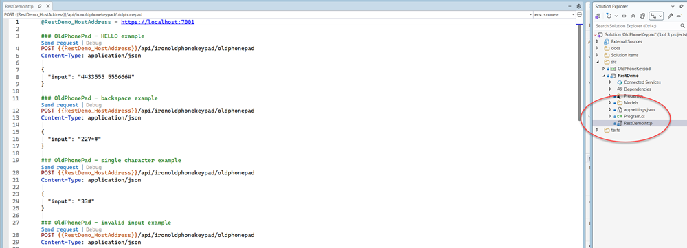
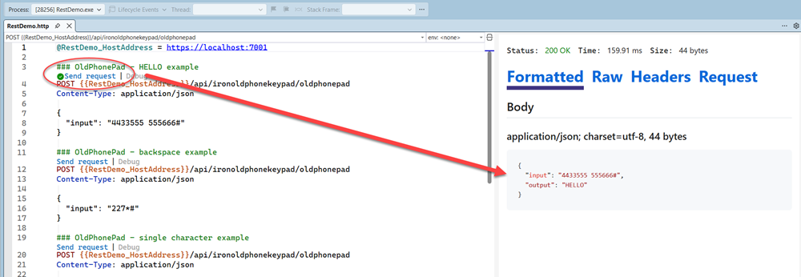
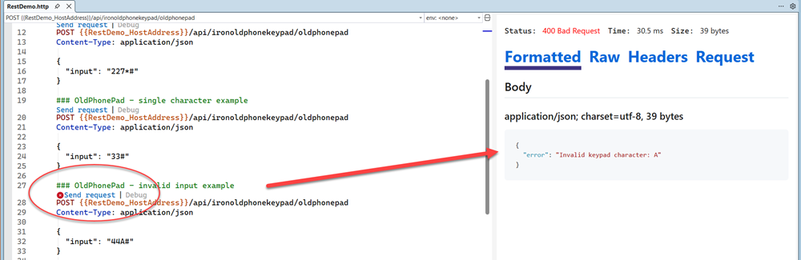
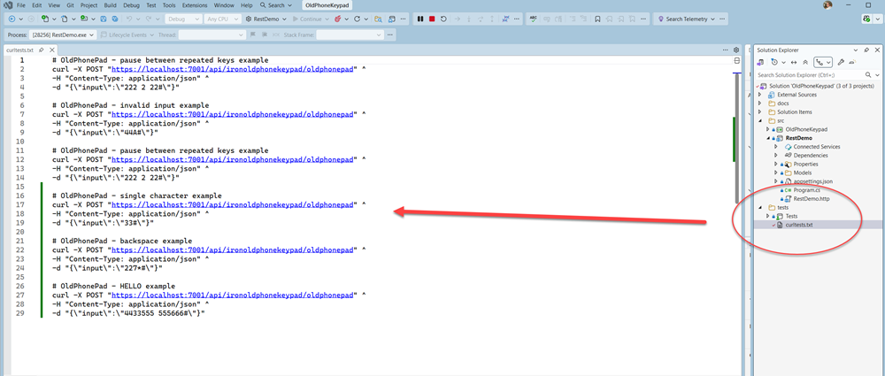

# HOW TO RUN

Use Visual Studio and the included `RestDemo.http` file to quickly run and test the REST API demo application.

## Prerequisites

- Visual Studio 2026 or later is installed with the ASP.NET and .NET workloads.
- .NET 10 SDK is installed for the REST demo and test projects.
- curl is installed and available from the command line for command-line testing examples.
- HTTPS is enabled for the ASP.NET Core REST demo.
- If local ASP.NET Core development certificates are not already installed or trusted, Visual Studio or the .NET SDK may prompt to install and trust a local development certificate during first launch.

## Running the REST Demo

1. Open the solution in Visual Studio.
2. Set `RestDemo` as the startup project if not already selected.
3. Press `F5` or `Ctrl+F5` to launch the application.

The REST API starts locally using the configured development profile.

Default URLs:

```text
https://localhost:7001
http://localhost:5059
```

---

## Send Requests from Visual Studio

The project includes a `RestDemo.http` file containing ready-to-run HTTP example requests. The `.http` file format allows HTTP requests to be executed directly from Visual Studio without requiring external tools such as Postman or curl.

* Open  `RestDemo.http` in Visual Studio while `RestDemo` is running.



* Click `Send Request` in any request block to execute the request.

### Example Requests

The following examples show common REST API requests and expected responses.

#### Successful Parse Example

Example request:



```http
POST https://localhost:7001/api/ironoldphonekeypad/oldphonepad
Content-Type: application/json

{
  "input": "4433555 555666#"
}
```

Expected HTTP status:

```http
200 OK
```

Expected response:

```json
{
  "input": "4433555 555666#",
  "output": "HELLO"
}
```


#### Invalid Input Example

Example request:



```http
POST https://localhost:7001/api/ironoldphonekeypad/oldphonepad
Content-Type: application/json

{
  "input": "44A#"
}
```

Expected HTTP status:

```http
400 Bad Request
```

Expected response:

```json
{
  "error": "Invalid keypad character: A"
}
```


#### Single Character Example

Example request:



```http
POST https://localhost:7001/api/ironoldphonekeypad/oldphonepad
Content-Type: application/json

{
  "input": "33#"
}
```

Expected HTTP status:

```http
200 OK
```

Expected response:

```json
{
  "input": "33#",
  "output": "E"
}
```
---

## Running with curl

If curl is installed, you can also test the endpoint using curl. Ensure the `RestDemo` application is running before executing curl requests.

Open a command prompt or terminal window and execute the desired curl command.

```bash
curl -X POST "https://localhost:7001/api/ironoldphonekeypad/oldphonepad" \
-H "Content-Type: application/json" \
-d "{\"input\":\"222 2 22#\"}"
```
Execute more curl examples exercising the endpoint in the [`curltests.txt`](./curltests.txt) file available in the solution.

---

## Error Handling

The API returns standard HTTP status codes along with a JSON error response body.

| Status Code | Description      |
| ----------- | ---------------- |
| 200         | Successful parse |
| 400         | Invalid input    |

Example HTTP response:

```http
HTTP/1.1 400 Bad Request
Content-Type: application/json
```

```json
{
  "error": "Input must contain the '#' terminator."
}
```
Examples of invalid input include:

* Missing `#` terminator
* Unsupported keypad characters
* Invalid JSON request bodies